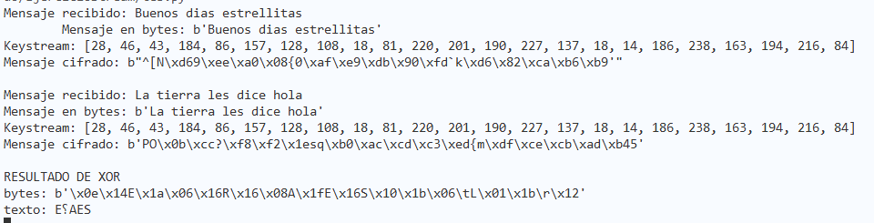
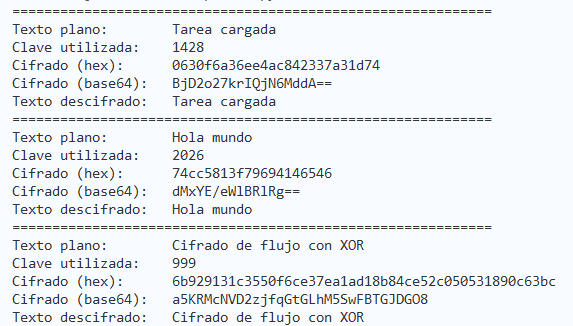
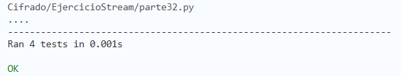

# Ejercicio Stream de cifrados

Es este ejercicio se realizó un stream cipher usando operaciones básicas como la generación de un keystream y XOR de bytes.

## Archivos
- [Stream cipher](stream_cipher.py)
- [Test dinamico](tests.py)

## Instalación y uso
### **Requisitos**
- Python

### **Instalación**
Clonar repo
```
git clone https://github.com/eunicean/EjercicioStream
```

### **Uso**

**Prueba básica de las funciones**
```
python stream_cipher.py
```
Variables a cambiar 
```python
clave = 1428
texto = "Tarea cargada"
```
---
**Prueba con mensaje personalizado**

Correr el programa
```bash
python tests.py
```
Ingresar los valores deseados cuando se soliciten:
```bash
Ingresa tu MENSAJE a encriptar
   → (MENSAJE DESEADO)
Ingresa la clave para generar el KEYSTREAM
   → (NUMERO DESEADO)
```

Luego verá el proceso que cada función realizó

## Preguntas de Análisis
### **2.1 Variación de clave**
Cuando se cambia la clave, el generador pseudoaleatorio crea un keystream diferente. Si se tiene un keystream diferente entonces el resultado del descifrado es diferente al mensaje original o pueden generarse 2 cifrados diferentes con el mismo mensaje.  

Diferente key mismo mensaje


Desencriptar con diferente mensaje


### **2.2 Reutilización del Keystream**
Usar el mismo keystream para 2 mensajes puede provocar que se revele información al realizar un XOR con ambos mensajes. Cancelando la llave. 

 

De ser que el XOR de más de un poco de texto, se puede usar para realizar un analisis de frecuencia y hcaer una decodificación con fuerza bruta.

### **2.3 Longitud del Keystream**
La longitud ideal del keystream es cuando es igual de largo que el mensaje a encriptar. Pero cuando el keystream es más pequeño que el tamaño que el mensaje, no se puede encriptar todo el mensaje. Si el keystream es más grande que el mensaje no hay mucho problema, solo de despedician recursos computacionales.

### **2.4 Consideraciones Prácticas**
** Ejemplos de: https://chatgpt.com/share/698e729c-aba0-800f-8104-f5303d1999fb
1. **Generador Criptográficamente Seguro**. 
2. **Nunca reutilizar el keystream**
3. **Gestión de Claves**

## Validación y Pruebas
### **Ejemplos de Entrada/Salida**
Archivo: [3.1 Ejemplos de entrada/salida ](parte31.py)

Resultado:


### **Pruebas unitarias**
Archivo: [3.2 Pruebas Unitarias ](parte32.py)

Resultado:

