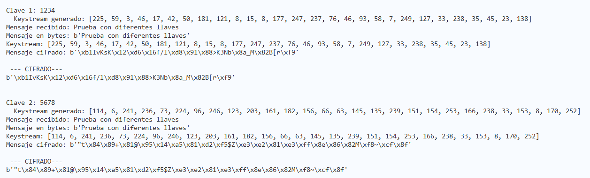

# Ejercicio Stream de cifrados

Es este ejercicio se realizó un stream cipher usando operaciones básicas como la generación de un keystream y XOR de bytes.

## Archivos
- [Stream cipher](stream_cipher.py)
- [Test dinamico](tests.py)

## Instalación y uso
### **Requisitos**
- Python

### **Instalación**
Clonar repo
```
git clone https://github.com/eunicean/EjercicioStream
```

### **Uso**

**Prueba básica de las funciones**
```
python stream_cipher.py
```
Variables a cambiar 
```python
clave = 1428
texto = "Tarea cargada"
```
---
**Prueba con mensaje personalizado**

Correr el programa
```bash
python tests.py
```
Ingresar los valores deseados cuando se soliciten:
```bash
Ingresa tu MENSAJE a encriptar
   → (MENSAJE DESEADO)
Ingresa la clave para generar el KEYSTREAM
   → (NUMERO DESEADO)
```

Luego verá el proceso que cada función realizó

## Preguntas de Análisis
### **2.1 Variación de clave**
Cuando se cambia la clave, el generador pseudoaleatorio crea un keystream diferente. Si se tiene un keystream diferente entonces el resultado del descifrado es diferente al mensaje original o pueden generarse 2 cifrados diferentes con el mismo mensaje.  

Diferente key mismo mensaje


Desencriptar con diferente mensaje


### **2.2 Reutilización del Keystream**


### **2.3 Longitud del Keystream**


### **2.4 Consideraciones Prácticas**